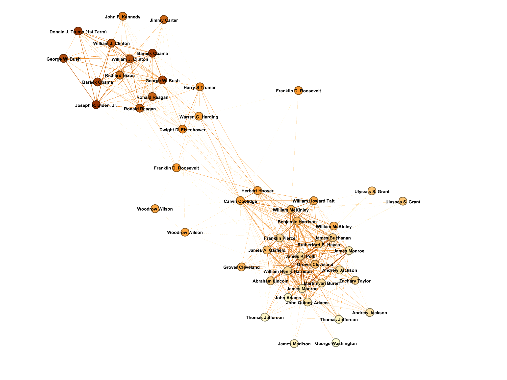

<h2>Table of Contents</h2>
<ul>
  <li><a href="#overview">Overview</a></li>
  <li><a href="#project-architecture">Project Architecture</a></li>
  <li><a href="#key-findings">Key findings</a></li>
</ul>

<h1> Text Analysis of U.S. presidents' inaugural speeches </h1>

<h2>Overview</h2>

This project analyzes U.S. presidential inaugural speeches by scraping them from the web, transforming them into numeric features, and exporting data suitable for both network analysis (Gephi) and visualization (Tableau dashboards).
 
 
<h2>Data Sources</h2>
<ul>
  <li>Inaugural Addresses: <a href="https://www.presidency.ucsb.edu/">UCSB Presidency Project</a></li>
  <li>Historical Rankings: <a href="https://en.wikipedia.org/wiki/Historical_rankings_of_presidents_of_the_United_States">Wikipedia</a></li>
  <li>Word Frequencies: <a href="https://www.kaggle.com/datasets/rtatman/english-word-frequency">Google Web Corpus (subset)</a></li>
</ul>
 
<h2>Project Architecture</h2>
<h3>Code files</h3>
1) <code>implementation.py</code> components: 
<ul>
  <li>Text Processing: Tokenization, lemmatization, and stopword removal</li>
  <li>Speech Metrics: Sentence length analysis, vocabulary complexity scoring</li>
  <li>Web Scrapers: Retrieves presidential rankings and inaugural address texts</li>
  <li>Network Preparation: Generates TF-IDF matrices and cosine similarity calculations</li>
  <li>Gephi Export: Creates node/edge tables for network visualization</li>
</ul>
 
2) <code>main.py</code>:
<ul>
  <li>Orchestrates data collection pipeline</li>
  <li>Aggregates linguistic metrics</li>
  <li>Exports structured data for visualization tools</li>
</ul>
 
<h3>Output files</h3>
<h4>Tableau files</h4>
1) <code>Tableau_data.csv</code> features:
<ul>
  <li>President: President's full name</li>
  <li>Date: Inauguration date (YYYY-MM-DD)</li>
  <li>Political_party: Party affiliation during inauguration</li>
  <li>Rank: Historical ranking from reference data</li>
  <li>Sentence_length: Average number of words per sentence</li>
  <li>Speech_complexity: Vocabulary rarity score</li>
  <li>*Speech_complex_percentage_change: the percentage change in speech complexity for reelected presidents. Note: this column was later calculated using Excel's built-in features</li>
</ul>

<h4>Gephi Files</h4>
1) <code>gephi_nodes.csv</code>:
<ul>
  <li>Label: President name</li>
  <li>Attribute: Inauguration year</li>
  <li>ID: Unique speech identifier</li>
</ul>
2) <code>gephi_edges.csv</code>:
<ul>
  <li>Source/Target: Node IDs</li>
  <li>Weight: Cosine similarity between speeches</li>
</ul>
 
<h2>Key findings</h2>
<h3>Tableau dashboard (<a href="https://public.tableau.com/views/AnalysisofPresidentialInauguralSpeeches/Dashboard1?:language=enUS&:sid=&:redirect=auth&:display_count=n&:origin=viz_share_link">link</a>)</h3>
<h4>Main takeaways: </h4>
<ul>
    <li>
        There is little to no correlation between a president's speech complexity and its historical ranking.
    </li>
    <li>
        Both the sentence length and the speech complexity decreased over time.
    </li>
    <li>
        It is unclear whether presidents construct their inaugural addresses differently after being reelected.
    </li>
</ul>

<h3>Gephi network graph</h3>
<h4>Notes on coloring:</h4>
<ul>
    <li>
        <strong>Nodes</strong>: The coloring of the nodes is based on the year the speech was delivered (dark orange represents the latest inaugural addresses, while light orange represents the oldest ones)
    </li>
    <li>
        <strong>Edges</strong>: The darker edges represent a stronger cosine similarity score. 
    </li>
</ul>

  
  
 fig. 1: the network graph 

<h4>Main takeaways:</h4>
<ul>
    <li>
        The speeches exhibit a clear clustering pattern according to their delivery date. 
    </li>
    <li>
        Two main clusters emerge: 1789 - 1933 and 1961 - present
    </li>
    <li>
        The speeches from World War-era presidents (Wilson, Roosevelt, and Truman) don't align with established inaugural address patterns, likely reflecting their unique wartime contexts.
    </li>
    <li>
        List of unique speeches (had a cosine similarity lower than 0.25 with any other inaugural address, and thus are not part of the graph):
        <ul>
            <li>
                <strong>Abraham Lincoln, 1865</strong>
            </li>
            <li>
                <strong>Franklin D. Roosevelt, 1945</strong>
            </li>
            <li>
                <strong>Theodor Roosevelt, 1905</strong>
            </li>
            <li>
                <strong>George Washington, 1793</strong>
            </li>
            <li>
                <strong>James Madison, 1813</strong>
            </li>
        </ul>
    </li>
</ul>

