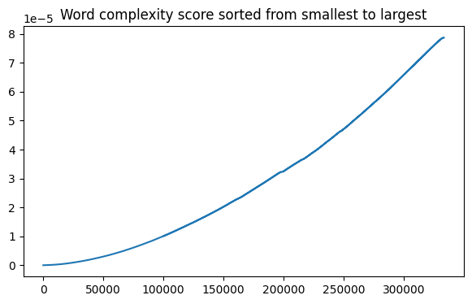

<h2>Table of Contents</h2>
<ul>
  <li><a href="#overview">Overview</a></li>
  <li><a href="#project-architecture">Project Architecture</a></li>
  <li><a href="#key-findings">Key findings</a></li>
</ul>

<h1> Text Analysis of U.S. presidents' inaugural speeches </h1>

<h2>Overview</h2>

This project analyzes U.S. presidential inaugural speeches by scraping them from the web, transforming them into numeric features, and exporting data suitable for both network analysis (Gephi) and visualization (Tableau dashboards).
 
 
The project is organized around two main files:
<ul>
    <li>
        <strong> <code>implementaition.py</code> </strong>: Contains the core functions for tokenizing, cleaning, and computing metrics on the speeches.
    </li>
    <li>
        <strong> <code>main.py</code> </strong>: Coordinates the workflow by calling those functions, building the final data frames, and saving them to CSV.
    </li>
</ul>
 

<h2>Project Architecture</h2>
<h3>Data Acquisition and Cleaning</h3>

The script main.py reads a list of U.S. presidents from an Excel file (presidents.xlsx), which was computed using <code>create_pres_table()</code>.
It then retrieves each presidential inaugural speech by calling get_speech(n) from <code>implementation.py</code>.
The function tokenize_and_clean() is used to clean each speech, removing stopwords and punctuation, and converting words to their base form (lemmatization).

<h3>Feature Computation</h3>

For each speech, the following metrics are computed: 

<ul>
    <li>
        <strong>Average Sentence Length:</strong> Calculated using <code>count_mean_words_per_sentence()</code>.
    </li>
    <li>
        <strong>Speech Complexity:</strong> Calculated with <code>word_complexity()</code>, which sums the reciprocals of each word's frequency in a large word-frequency dataset. The relationship is not linear (see fig. 1), meaning the most frequent words significantly lower the overall speech score.
    </li>
</ul>

  
  
 fig. 1

All speeches (token lists) are stored in a corpus, which is later passed to <code>cosine_similarity_matrix()</code> to compute a document-to-document similarity matrix.

<h3>Thresholding for Network</h3>

The cosine similarity threshold is set at 0.25, so only pairs of speeches with a similarity score above that value are kept as edges in gephi_edges.csv.

<h3>Main Dataframes and Data Storage</h3>
<ul>
    <li>
        <strong>df</strong>: Collects all the vital information about each inaugural address, including the president's name, date, rank, political party, etc. The information gets stored in <code>table.csv</code> for further analysis in Tableau.
        
Below is a brief description of each column in <code>table.csv</code>:

        <ul>
            <li> 
                <strong>Id</strong>: Numerical identifier for each presidential inaugural speech (0 to 53).
            </li>
            <li>
                <strong>President</strong>: The name of the president who delivered the speech.
            </li>
            <li>
                <strong>Date</strong>: The date of the inaugural address.
            </li>
            <li>
                <strong>Political_party</strong>: The political affiliation of the president, extracted from <code>presidents.xlsx</code>.
            </li>
            <li>
                <strong>Rank</strong>: A historians-assigned rank (from the dataset in <code>presidents.xlsx</code>. Source: American Political Science Association (APSA)).
            </li>
            <li>
                <strong>Sentence_length</strong>: The average number of words per sentence in the speech, computed by <code>count_mean_words_per_sentence()</code>.
            </li>
            <li>
                <strong>Speech_complexity</strong>: The speech complexity, calculated with <code>word_complexity()</code>, indicates how frequently used or rare the speech’s vocabulary is.
            </li>
        </ul>
         
    </li>
    <li>
        <strong>nodes_df</strong>: Contains node information (speech ID, president's name, speech date). The information gets stored in <code>gephi_edges.csv</code> for further Gephi network analysis and visualization.
    </li>
    <li>
        <strong>edges_df</strong>: Contains the edges (pairs of speeches) and their cosine similarity weight. The information gets stored in <code>gephi_nodes.csv</code>, again, for further Gephi network analysis and visualization. 
    </li>
</ul>
 
<h2>Key findings</h2>
<h3>Tableau dashboard (<a href="https://public.tableau.com/views/AnalysisofPresidentialInauguralSpeeches/Dashboard1?:language=enUS&:sid=&:redirect=auth&:display_count=n&:origin=viz_share_link">link</a>)</h3>
<h4>Main takeaways: </h4>
<ul>
    <li>
        There is little to no correlation between a president's speech complexity and its historical ranking.
    </li>
    <li>
        Both the sentence length and the speech complexity decreased over time.
    </li>
    <li>
        It is unclear whether presidents construct their inaugural addresses differently after being reelected.
    </li>
</ul>

<h3>Gephi network graph</h3>
<h4>Notes on coloring:</h4>
<ul>
    <li>
        <strong>Nodes</strong>: The coloring of the nodes is based on the year the speech was delivered (dark orange represents the latest inaugural addresses, while light orange represents the oldest ones)
    </li>
    <li>
        <strong>Edges</strong>: The darker edges represent a stronger cosine similarity score. 
    </li>
</ul>

  
  
 fig. 4: the network graph 

<h4>Main takeaways:</h4>
<ul>
    <li>
        The speeches are clearly clustered based on their date of delivery. 
    </li>
    <li>
        Two main clusters emerge: 1789 - 1933 and 1961 - present
    </li>
    <li>
        The inaugural speeches of the U.S. presidents who served during military involvement in the World Wars—Woodrow Wilson, Franklin D. Roosevelt, and Harry S. Truman—do not neatly fit into either of the established clusters. This is likely due to the different nature of their addresses. 
    </li>
    <li>
        List of unique speeches (had a cosine similarity lower than 0.25 with any other inaugural address, and thus are not part of the graph):
        <ul>
            <li>
                <strong>Abraham Lincoln, 1865</strong>
            </li>
            <li>
                <strong>Franklin D. Roosevelt, 1945</strong>
            </li>
            <li>
                <strong>Theodor Roosevelt, 1905</strong>
            </li>
            <li>
                <strong>George Washington, 1793</strong>
            </li>
            <li>
                <strong>James Madison, 1813</strong>
            </li>
        </ul>
    </li>
</ul>

